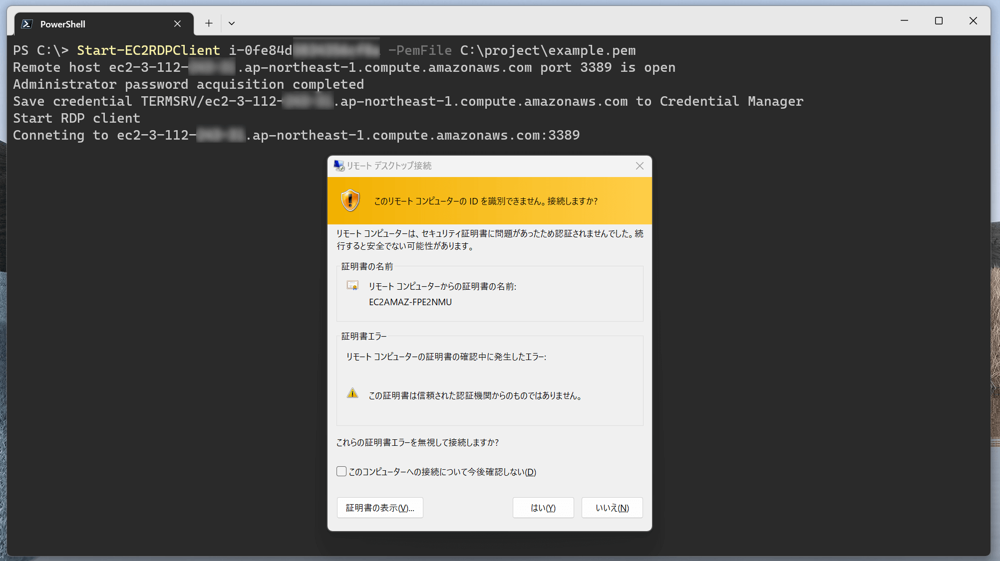
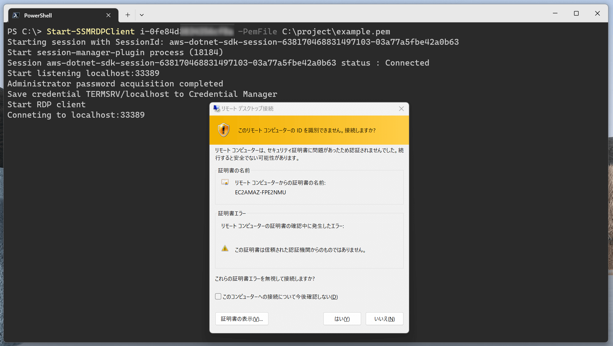
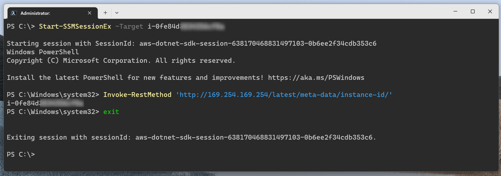
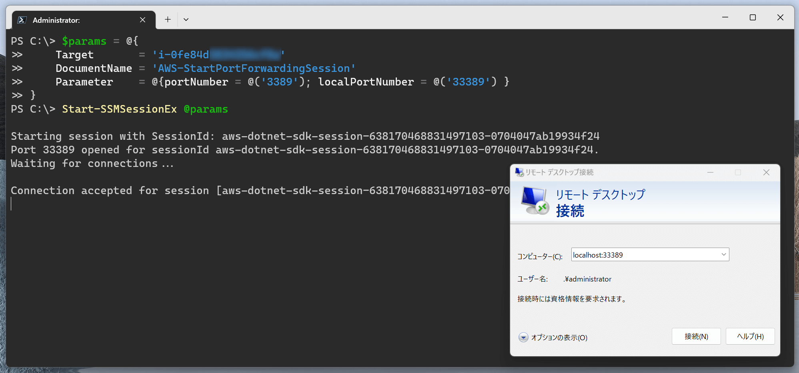

# PSEC2RDP

Remote Desktop Utility for Amazon EC2.

## How to install

Currently, No plans to publish this module.  

```powershell
# Clone this repository and execute Import-Module manually.
git clone https://github.com/stknohg/PSEC2RDP.git
Import-Module .\PSEC2RDP\PSEC2RDP\ -Force
```

## Prerequisites

* Windows
* PowerShell 7+
* AWS Tools for PowerShell ([AWS.Tools.EC2](https://www.powershellgallery.com/packages/AWS.Tools.EC2/), [AWS.Tools.SimpleSystemsManagement](https://www.powershellgallery.com/packages/AWS.Tools.SimpleSystemsManagement/) modules)
* [Session Manager plugin](https://docs.aws.amazon.com/systems-manager/latest/userguide/session-manager-working-with-install-plugin.html)

## Functions

### Start-EC2RDPClient

Connect to public EC2 instance with Remote Desktop Client.

```powershell
Start-EC2RDPClient 'EC2 Instance ID' -PemFile 'Path to private key file (.pem)'
```

#### Example

```powershell
# Setup your profile
PS C:\> Set-AWSCredential -ProfileName your_profile
PS C:\> Set-DefaultAWSRegion ap-northeast-1

# Connect to EC2
PS C:\> Start-EC2RDPClient i-01234567890abcdef -PemFile C:\project\example.pem
```



### Start-SSMRDPClient

Connect to EC2 instance with Remote Desktop Client via SSM port forwarding.  

> **Note**  
> You need to use shared credentials file (same as AWS CLI credentials) to set your profile .

```powershell
Start-SSMRDPClient 'EC2 Instance ID' -PemFile 'Path to private key file (.pem)'
```

#### Example

```powershell
# Setup your profile
PS C:\> Set-AWSCredential -ProfileName your_profile
PS C:\> Set-DefaultAWSRegion ap-northeast-1

# Connect to EC2 via SSM port forwarding
PS C:\> Start-SSMRDPClient i-01234567890abcdef -PemFile C:\project\example.pem
```



### Start-SSMSessionEx

Start SSM session and execute `session-manager-plugin` process.  

> **Note**  
> You need to use shared credentials file (same as AWS CLI credentials) to set your profile .

```powershell
Start-SSMSessionEx -Target 'EC2 Instance ID' -DocumentName 'SSM document name' -Parameter 'SSM document parameters'
```

#### Example.1

Connect EC2 instance by default.

```powershell
# Setup your profile
PS C:\> Set-AWSCredential -ProfileName your_profile
PS C:\> Set-DefaultAWSRegion ap-northeast-1

# Start SSM Session 
PS C:\> Start-SSMSessionEx -Target i-01234567890abcdef
```



```powershell
# You can use -PassThru parameter
PS C:\> $result = Start-SSMSessionEx -Target i-01234567890abcdef -PassThru
Starting session with SessionId: aws-dotnet-sdk-session-xxxxxxxxxxxxxxxxxx-yyyyyyyyyyyyyyyyy
Start session-manager-plugin process (24776)

# In this case, you must close SSM Session manually
PS C:\> Stop-SSMSession -SessionId $result.Session.SessionId
aws-dotnet-sdk-session-xxxxxxxxxxxxxxxxxx-yyyyyyyyyyyyyyyyy
# If needed, terminate session-manager-plugin manually
PS C:\> Stop-Process $result.Process.Id -ErrorAction Ignore
```

#### Example.2

You can do port forwarding with this function.

```powershell
# Start RDP port forwarding
PS C:\> $params = @{
>>     Target       = 'i-01234567890abcdef'
>>     DocumentName = 'AWS-StartPortForwardingSession'
>>     Parameter    = @{portNumber = @('3389'); localPortNumber = @('33389') }
>> }
PS C:\> Start-SSMSessionEx @params
```



## License

* [MIT](./LICENSE)
